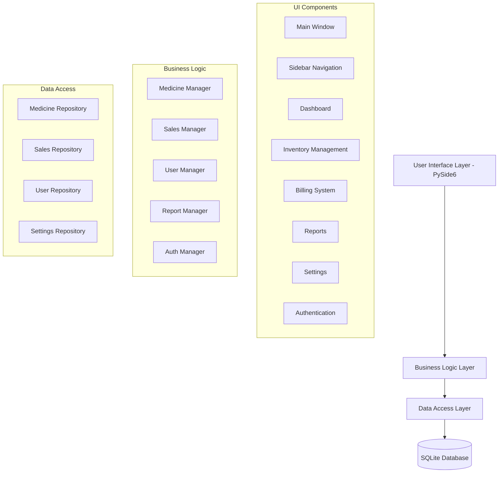
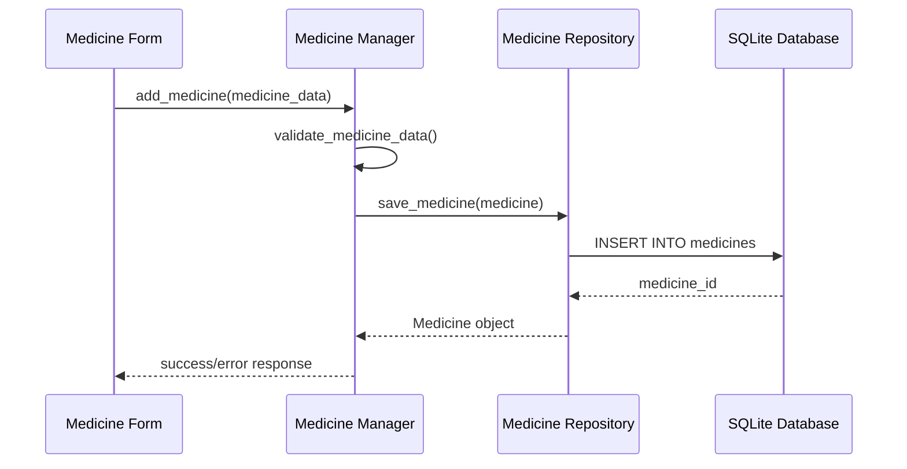
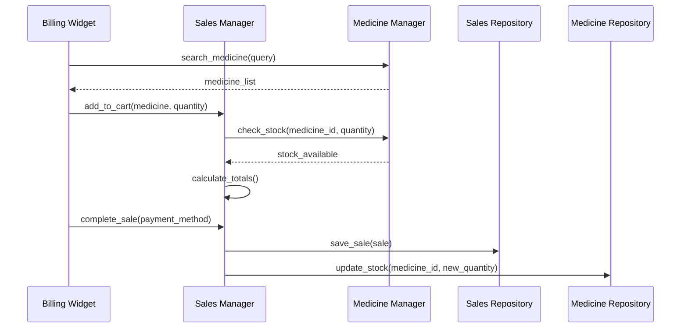
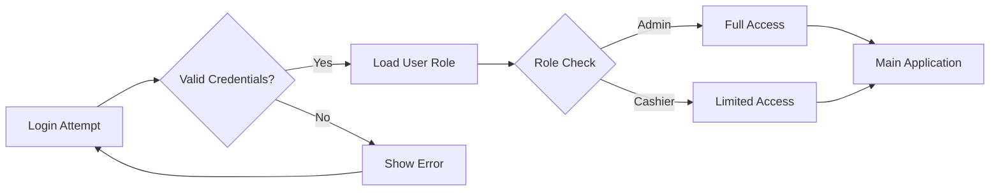

# Design Document

## Overview

The Medical Store Management Application is designed as a desktop application using PySide6 (Qt for Python) with a Model-View-Controller (MVC) architecture. The application will feature a modern, responsive UI with smooth animations, local SQLite database storage, and role-based access control. The design emphasizes modularity, maintainability, and performance optimization for low-end hardware.

## Architecture

### High-Level Architecture



### MVC Pattern Implementation

- **Model**: Data classes and business logic (Medicine, Sale, User, etc.)
- **View**: PySide6 UI components and windows
- **Controller**: Business logic managers that coordinate between views and models

## Components and Interfaces

### 1. Main Application Structure

```
medical_store_app/
├── main.py                 # Application entry point
├── config/
│   ├── __init__.py
│   ├── database.py         # Database configuration
│   └── settings.py         # Application settings
├── models/
│   ├── __init__.py
│   ├── medicine.py         # Medicine data model
│   ├── sale.py            # Sale data model
│   ├── user.py            # User data model
│   └── base.py            # Base model class
├── repositories/
│   ├── __init__.py
│   ├── medicine_repository.py
│   ├── sales_repository.py
│   ├── user_repository.py
│   └── settings_repository.py
├── managers/
│   ├── __init__.py
│   ├── medicine_manager.py
│   ├── sales_manager.py
│   ├── user_manager.py
│   ├── report_manager.py
│   └── auth_manager.py
├── ui/
│   ├── __init__.py
│   ├── main_window.py      # Main application window
│   ├── components/
│   │   ├── sidebar.py      # Navigation sidebar
│   │   ├── dashboard.py    # Dashboard widgets
│   │   ├── medicine_form.py
│   │   ├── medicine_table.py
│   │   ├── billing_widget.py
│   │   ├── reports_widget.py
│   │   └── settings_widget.py
│   └── dialogs/
│       ├── login_dialog.py
│       ├── medicine_dialog.py
│       └── backup_dialog.py
├── utils/
│   ├── __init__.py
│   ├── validators.py       # Input validation
│   ├── formatters.py       # Data formatting
│   └── backup.py          # Backup/restore utilities
└── resources/
    ├── styles/
    │   └── main.qss        # Qt Style Sheets
    └── icons/              # Application icons
```

### 2. Database Design

#### Database Schema Implementation

```sql
-- medicines table
CREATE TABLE medicines (
    id INTEGER PRIMARY KEY AUTOINCREMENT,
    name TEXT NOT NULL,
    category TEXT NOT NULL,
    batch_no TEXT NOT NULL,
    expiry_date TEXT NOT NULL,
    quantity INTEGER NOT NULL DEFAULT 0,
    purchase_price REAL NOT NULL DEFAULT 0.0,
    selling_price REAL NOT NULL DEFAULT 0.0,
    barcode TEXT UNIQUE,
    created_at TEXT DEFAULT CURRENT_TIMESTAMP,
    updated_at TEXT DEFAULT CURRENT_TIMESTAMP
);

-- sales table
CREATE TABLE sales (
    id INTEGER PRIMARY KEY AUTOINCREMENT,
    date TEXT NOT NULL,
    items TEXT NOT NULL, -- JSON array of sold items
    subtotal REAL NOT NULL DEFAULT 0.0,
    discount REAL NOT NULL DEFAULT 0.0,
    tax REAL NOT NULL DEFAULT 0.0,
    total REAL NOT NULL DEFAULT 0.0,
    payment_method TEXT NOT NULL DEFAULT 'cash',
    cashier_id INTEGER,
    created_at TEXT DEFAULT CURRENT_TIMESTAMP,
    FOREIGN KEY (cashier_id) REFERENCES users(id)
);

-- users table
CREATE TABLE users (
    id INTEGER PRIMARY KEY AUTOINCREMENT,
    username TEXT UNIQUE NOT NULL,
    password_hash TEXT NOT NULL,
    role TEXT NOT NULL CHECK (role IN ('admin', 'cashier')),
    is_active BOOLEAN DEFAULT 1,
    created_at TEXT DEFAULT CURRENT_TIMESTAMP,
    last_login TEXT
);

-- settings table
CREATE TABLE settings (
    key TEXT PRIMARY KEY,
    value TEXT NOT NULL,
    description TEXT,
    updated_at TEXT DEFAULT CURRENT_TIMESTAMP
);
```

### 3. Core Models

#### Medicine Model
```python
@dataclass
class Medicine:
    id: Optional[int] = None
    name: str = ""
    category: str = ""
    batch_no: str = ""
    expiry_date: str = ""
    quantity: int = 0
    purchase_price: float = 0.0
    selling_price: float = 0.0
    barcode: Optional[str] = None
    created_at: Optional[str] = None
    updated_at: Optional[str] = None
    
    def is_low_stock(self, threshold: int = 10) -> bool:
        return self.quantity <= threshold
    
    def is_expired(self) -> bool:
        # Implementation for expiry check
        pass
```

#### Sale Model
```python
@dataclass
class SaleItem:
    medicine_id: int
    name: str
    quantity: int
    unit_price: float
    total_price: float

@dataclass
class Sale:
    id: Optional[int] = None
    date: str = ""
    items: List[SaleItem] = field(default_factory=list)
    subtotal: float = 0.0
    discount: float = 0.0
    tax: float = 0.0
    total: float = 0.0
    payment_method: str = "cash"
    cashier_id: Optional[int] = None
    created_at: Optional[str] = None
```

### 4. User Interface Design

#### Main Window Layout
- **Header Bar**: Application title, user info, logout button
- **Sidebar**: Collapsible navigation menu with icons
- **Content Area**: Dynamic content based on selected menu item
- **Status Bar**: Connection status, current user, time

#### Color Scheme and Styling
```css
/* Main color palette */
:root {
    --primary-color: #2D9CDB;
    --secondary-color: #27AE60;
    --accent-color: #F2C94C;
    --background-color: #F8F9FA;
    --text-color: #333333;
    --border-color: #E1E5E9;
    --hover-color: #F1F3F4;
}
```

#### Responsive Design Considerations
- Minimum window size: 1024x768
- Scalable UI elements for different screen sizes
- Keyboard navigation support
- High DPI display compatibility

## Data Models

### 1. Medicine Management Data Flow



### 2. Billing System Data Flow



### 3. Authentication and Authorization



## Error Handling

### 1. Database Error Handling
- Connection failures: Retry mechanism with exponential backoff
- Transaction failures: Automatic rollback and user notification
- Data integrity violations: Validation before database operations
- Backup/restore errors: Comprehensive error logging and user feedback

### 2. Input Validation
- Client-side validation for all form inputs
- Server-side validation in business logic layer
- Sanitization of user inputs to prevent SQL injection
- Type checking and range validation for numeric inputs

### 3. User Experience Error Handling
- Non-blocking error messages with clear descriptions
- Graceful degradation when features are unavailable
- Progress indicators for long-running operations
- Undo functionality for critical operations

### 4. Logging Strategy
```python
# Logging configuration
LOGGING_CONFIG = {
    'version': 1,
    'disable_existing_loggers': False,
    'formatters': {
        'standard': {
            'format': '%(asctime)s [%(levelname)s] %(name)s: %(message)s'
        },
    },
    'handlers': {
        'file': {
            'level': 'INFO',
            'class': 'logging.handlers.RotatingFileHandler',
            'filename': 'medical_store.log',
            'maxBytes': 10485760,  # 10MB
            'backupCount': 5,
            'formatter': 'standard',
        },
    },
    'loggers': {
        '': {
            'handlers': ['file'],
            'level': 'INFO',
            'propagate': False
        }
    }
}
```

## Testing Strategy

### 1. Unit Testing
- **Models**: Test data validation, business logic, and calculations
- **Repositories**: Test CRUD operations and database interactions
- **Managers**: Test business logic coordination and error handling
- **Utilities**: Test helper functions and data transformations

### 2. Integration Testing
- **Database Integration**: Test complete data flow from UI to database
- **Authentication Flow**: Test login, logout, and role-based access
- **Billing Process**: Test complete sales transaction workflow
- **Report Generation**: Test data aggregation and export functionality

### 3. UI Testing
- **Widget Functionality**: Test form submissions, table operations, and navigation
- **User Interactions**: Test button clicks, menu selections, and keyboard shortcuts
- **Responsive Design**: Test UI behavior at different window sizes
- **Animation and Transitions**: Test smooth UI transitions and performance

### 4. Performance Testing
- **Database Performance**: Test query performance with large datasets
- **UI Responsiveness**: Test UI performance during heavy operations
- **Memory Usage**: Monitor memory consumption and prevent leaks
- **Startup Time**: Optimize application startup performance

### 5. Security Testing
- **Authentication**: Test password hashing and session management
- **Authorization**: Test role-based access control enforcement
- **Input Validation**: Test against SQL injection and XSS attacks
- **Data Protection**: Test backup encryption and data integrity

### 6. Test Data Management
```python
# Test fixtures for consistent testing
@pytest.fixture
def sample_medicines():
    return [
        Medicine(name="Paracetamol", category="Pain Relief", 
                batch_no="PAR001", expiry_date="2025-12-31", 
                quantity=100, purchase_price=5.0, selling_price=8.0),
        Medicine(name="Amoxicillin", category="Antibiotic", 
                batch_no="AMX001", expiry_date="2024-06-30", 
                quantity=50, purchase_price=12.0, selling_price=18.0)
    ]

@pytest.fixture
def test_database():
    # Create in-memory database for testing
    db = sqlite3.connect(":memory:")
    # Initialize schema
    yield db
    db.close()
```

### 7. Continuous Integration
- Automated test execution on code changes
- Code coverage reporting (target: >90%)
- Static code analysis with pylint and mypy
- Performance regression testing
- Security vulnerability scanning

This comprehensive design provides a solid foundation for implementing the Medical Store Management Application with proper separation of concerns, robust error handling, and thorough testing coverage.